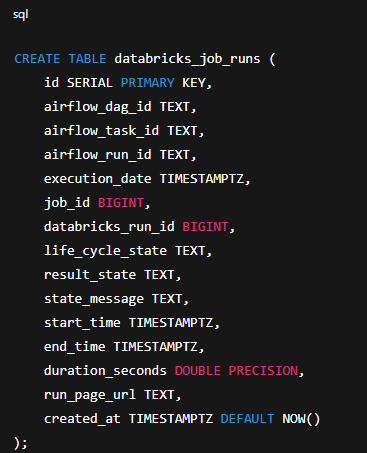

# Airflow-Based Databricks Job Monitoring & Alerting System

## 📌 Project Summary

This project was built to answer two real-world operational monitoring challenges:

1️⃣ **Can Airflow automatically send all failed job information to a Microsoft Teams group?**  
2️⃣ **For a set of Databricks jobs, can we check each job's last run time and detect unusually short runs (possible skipped logic), then alert the team?**

To solve these, I designed and implemented a complete monitoring framework in **Apache Airflow**, integrating:

- **Databricks → Airflow**
- **Airflow → Postgres**
- **Postgres → analytical logic**
- **Airflow → Microsoft Teams alerts**

This system is fully automated, modular, and production-ready.

---

## 🎯 Objectives

### ✔ Capture every Databricks job’s execution details

Using Airflow as the orchestrator, every triggered Databricks job returns metadata such as:

- Run ID  
- State (SUCCESS / FAILED)  
- Start & end time  
- Duration  
- Run Page URL  
- Error message(s)

These details are stored in **Postgres**.

---

### ✔ Send Microsoft Teams alerts on job failures

A dedicated Airflow notification utility pushes failure/success messages to a Teams channel using an **Incoming Webhook**.

Alerts include:

- DAG ID  
- Task ID  
- Run ID  
- Execution timestamp  
- Status  
- Direct link to Databricks run page  

---

### ✔ Detect suspiciously short job durations

A second, independent monitoring DAG analyzes the latest run of each job and evaluates:

- Did the job finish too quickly?  
- Is the duration below a configured threshold?  
- Does this deviate from normal behavior?  

If **yes → send a Teams alert** prompting engineers to investigate.

This solves silent failures or *"job skipped work but succeeded"* issues.

---

                ┌──────────────┐
                │ Airflow DAG  │
                │ (Job Trigger)│
                └──────┬───────┘
                       │ Trigger Databricks Job
                       ▼
              ┌───────────────────────┐
              │ Databricks Job Run    │
              └──────────┬────────────┘
                         │ Metadata via API
                         ▼
                ┌────────────────┐
                │ Airflow Python │
                │ (Post-run hook)│
                └────────┬───────┘
                         │ Insert
                         ▼
                 ┌─────────────┐
                 │ Postgres DB │
                 │  run table  │
                 └──────┬──────┘
                        │ Read latest runs
                        ▼
            ┌─────────────────────────┐
            │ Airflow Monitoring DAG  │
            │   Analyze durations     │
            │   Detect anomalies      │
            └──────────┬──────────────┘
                       │ Alerts
                       ▼
            ┌─────────────────────────┐
            │ Microsoft Teams Channel │
            └─────────────────────────┘


## 🧩 Components Implemented

### 1. **Databricks Job Triggering DAG**
Located in:

```dags/databricks_job_migration_dag.py```

This DAG:
- Triggers a Databricks Job using `DatabricksRunNowOperator`
- Fetches run details using `DatabricksHook.get_run()`
- Converts timestamps into Python `datetime`
- Calculates `duration_seconds`
- Inserts job execution metadata into Postgres table `databricks_job_runs`
- Sends Teams notifications via `on_success_callback` and `on_failure_callback`

---

### 2. **Databricks Run Metadata Table**

A dedicated table stores each Databricks job run.  
Postgres table that stores each job run:


---

### 3. **Microsoft Teams Notification Utility**

Reusable helper located at:

```dags/utils/teams_notifier.py```

Used by:

- The main Databricks DAG (success/failure)  
- The monitoring DAG (anomaly alerts)

Sends customizable **MessageCard** alerts to Teams.

---

### 4. **Monitoring DAG (Independent Anomaly Detector)**
Located in:

```dags/databricks_jobs_duration_monitor.py```

This DAG:

- Runs on a schedule (e.g., every 10 minutes)
- Reads the latest run for each job from Postgres
- Applies per-job or default duration thresholds
- Flags:
  - extremely short runs  
  - suspicious successes  
  - possible skipped logic  

Sends a **single Teams alert** summarizing all problematic jobs.

Example cases detected:

- Workflow skipped a major step but still succeeded  
- Data fetch job returned empty due to API rate limit  
- Job hit an early return path  
- Downstream dependencies failed silently  

This DAG provides early warning signals for operational issues.

---

## 🎉 Key Outcomes

### 🔹 Automated failure alerts for all Databricks jobs  
No job fails silently — Teams receives every failure instantly.

### 🔹 Continuous monitoring of job health  
The system not only catches failures but also detects:

- Partial failures  
- Logic skips  
- Half-run jobs  
- “Succeeded too quickly” anomalies  

### 🔹 Centralized historical record  
All runs are stored in Postgres — great for dashboards, trending, audits.

### 🔹 Scalable to any number of jobs  
Just add job IDs to the `thresholds` dictionary — the system adapts automatically.

### 🔹 Clear separation of orchestration & monitoring  
Two independent DAGs:

- One for execution  
- One for monitoring + alerting  

---

## 💡 Why This Project Matters

Many teams struggle because Databricks jobs:

- succeed even when work is skipped  
- fail silently  
- finish instantly due to missing input  
- break after code changes  
- behave inconsistently across environments  

This system catches all of these before they escalate into data issues.

It provides:

- Reliability  
- Observability  
- Automated alerting  
- Historical tracking  

Exactly what a modern data engineering pipeline requires.

---

## 📞 Want to Extend the System?

Possible enhancements include:

- Average-duration–based thresholds  
- SLA checks  
- Integration with Prometheus/Grafana  
- Automatic retry/rollback  
- Slack integration  
- Cost monitoring per job  

---
